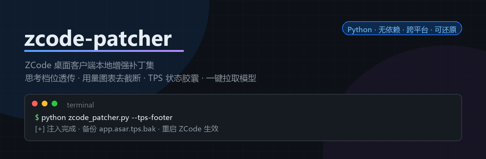

# zcode-tokenspeed · ZCode 客户端增强插件



给 ZCode 桌面客户端补上几件顺手的事：**自定义模型的思考档位真正生效**、**用量页图表不再截断**、
**输入框实时 TPS 统计条**、**一键增强提示词**、**设置页一键拉取模型**。

纯 Python 标准库实现，不依赖 Node、不需要编译；所有改动都作用于**本地已安装的客户端文件**，
幂等、可 `--check` 核查、可 `--revert` 精确还原、可在插件详情页逐项开关。

> **非官方项目**，与 ZCode 官方无任何关联。请遵守 ZCode 软件许可协议，因使用本工具产生的一切后果由使用者自行承担。
> 第三方组件的许可声明见 [NOTICE.md](NOTICE.md)。

---

## 功能一览

| # | 功能 | 效果 | 命令 | 改动位置 |
|---|------|------|------|---------|
| 1 | **思考档位配置** | 把各模型已配的档位写进 `provider_config.json` 的 `optionSpecs`——界面档位列表与请求体参数都由它下发（3.14+ 原生机制，**无需内核补丁**） | `--reasoning-config` | `~/.zcode/v2/provider_config.json` |
| 2 | **思考等级透传** | ≤3.11 内核的档位兜底补丁（3.14+ 已不需要，脚本会明确提示） | 无参数 | 内核 `zcode.cjs` |
| 3 | **用量页去截断** | 「设置 → 用量」趋势图不再只画 Top 6、饼图不再只画 Top 5 + 「其他模型」 | `--usage-chart` | `app.asar` 渲染文件 |
| 4 | **模型弹窗加宽** | 模型选择浮窗 192px → 320px，长模型名不再被截断 | `--model-width` | `app.asar` 主 bundle |
| 5 | **TPS 状态栏** | 输入框下方常驻统计条：本轮（首 token / tok/s / out）+ 会话累计（轮数 / 输入 / 命中率 / 累出），空会话空态常驻，右键可切位置 | `--tps-footer` | `app.asar` 注入脚本 |
| 6 | **思考强度滑条** | 工具栏「思考 · 档名」入口，点击弹出吸附拖拽条，拖完走原生链路即时生效 | `--thought-slider` | `app.asar` 注入脚本 |
| 7 | **增强提示词** | 输入框旁「增强提示词」按钮：一键用**当前选中的模型**把草稿改写得更清晰具体，可「恢复原文」 | `--enhance-prompt` | `app.asar` 注入脚本 + IPC 桥 |
| 8 | **模型拉取按钮** | 设置页「⚡️ 自动拉取模型」：拉取供应商 `/models`、勾选即写入，新供应商一步到位（自动建条目） | `--model-puller` | `app.asar` 注入脚本 + IPC 桥 |

命令行版拉模型（不动客户端文件，直接同步配置）：

```bash
python skills/zcode-tokenspeed/scripts/model_pull.py --all [--dry-run] [--refresh]
```

**通用开关**：`--check` 只读核查 · `--revert` 还原 · `--dry-run` 只报告改动不写盘 ·
`--verbose` 打印探测细节 · `--force` 跳过备份指纹校验（慎用）· `--prune` 清理补丁产物（`--deep` 连当前备份一起清）。

---

## 安装

### 方式一：作为 ZCode 插件（推荐）

```bash
git clone https://github.com/c80361619/zCode-Multi-functional-plugin..git zcode-tokenspeed
```

把克隆得到的目录放进 ZCode 的插件目录，重启 ZCode 即可：

| 平台 | 插件目录 |
|---|---|
| Windows | `%USERPROFILE%\.zcode\plugins\`（数据目录迁移过的用户是 `<dataBaseDir>\.zcode\plugins\`） |
| macOS / Linux | `~/.zcode/plugins/` |

安装后在新任务里可以用斜杠命令：

| 命令 | 作用 |
|---|---|
| `/zcode-patch-status` | 只读核查所有补丁状态 |
| `/zcode-patch-apply` | 注入指定补丁 |
| `/zcode-patch-revert` | 还原指定补丁 |
| `/zcode-patch-toggle` | 查看/切换各项开关（也可直接在插件详情页拨开关） |

开关拨动并保存后：配置类补丁（档位配置）与字节级补丁（用量图 / 弹窗加宽）下次会话启动即生效；
重打包级补丁（状态栏 / 滑条 / 增强提示词 / 拉取按钮）会在 **ZCode 退出时**由看护自动应用。

### 方式二：手动跑脚本

```bash
# 1) 只读核查（可放心先跑，不会改任何文件）
python skills/zcode-tokenspeed/scripts/zcode_patcher.py --reasoning-config --check
python skills/zcode-tokenspeed/scripts/zcode_patcher.py --check
python skills/zcode-tokenspeed/scripts/zcode_patcher.py --usage-chart --check
python skills/zcode-tokenspeed/scripts/zcode_patcher.py --model-width --check
python skills/zcode-tokenspeed/scripts/zcode_patcher.py --tps-footer --check
python skills/zcode-tokenspeed/scripts/zcode_patcher.py --thought-slider --check
python skills/zcode-tokenspeed/scripts/zcode_patcher.py --enhance-prompt --check
python skills/zcode-tokenspeed/scripts/zcode_patcher.py --model-puller --check

# 2) 打补丁（先完全退出 ZCode；脚本会预检进程，运行中直接拒绝）
python skills/zcode-tokenspeed/scripts/zcode_patcher.py --reasoning-config
python skills/zcode-tokenspeed/scripts/zcode_patcher.py --tps-footer --thought-slider --enhance-prompt --model-puller

# 3) 还原（随时可退，精确到字节）
python skills/zcode-tokenspeed/scripts/zcode_patcher.py --tps-footer --revert
```

安装位置自动探测（运行中进程 → 注册表 → 常见目录，跨 Windows / macOS / Linux）；
探测不到就把安装根目录当参数传入：

```bash
python skills/zcode-tokenspeed/scripts/zcode_patcher.py "D:\ZCode"                  # Windows
python skills/zcode-tokenspeed/scripts/zcode_patcher.py "/Applications/ZCode.app"  # macOS
```

---

## 环境要求

| 项 | 要求 |
|---|---|
| Python | ≥ 3.10（仅标准库，无需 pip 安装任何依赖） |
| ZCode | 3.11.2 / 3.14.1 / 3.14.3 实测通过；其它版本脚本会**拒绝盲改并说明原因** |
| 平台 | Windows 实测；macOS / Linux 逻辑支持（macOS 改 `.app` 会破坏代码签名，异常时 `sudo codesign --force --deep --sign - /Applications/ZCode.app`） |
| 权限 | Program Files / `/Applications` 下需要管理员或 sudo |

---

## 思考档位怎么用（按版本分流）

ZCode 对「非内核白名单」的自定义模型，档位能选中但参数不一定下发到请求体。**机制在 3.14 换了**：

| 客户端版本 | 档位从哪来 | 参数怎么下发 | 该跑什么 |
|---|---|---|---|
| **≥ 3.14** | `provider_config.json` → `providerModelRules[].config.optionSpecs.reasoningLevel.values` | 同一条规则的 `optionSpecs.reasoningLevel.map`（CEL 表达式），请求发出前由内核合并进请求体 | `--reasoning-config`（**不需要内核补丁**） |
| ≤ 3.11 | `config.json` 的 `reasoning.variants` | 内核查表 `providerOptionsByLevel`（自定义模型为空）→ 需补丁兜底 | 内核补丁 + 手配 `variants` |

判别方法：跑 `zcode_patcher.py --check`，输出「该内核使用 3.14+ 原生档位机制（optionSpecs），本补丁不适用」即为 ≥3.14。

```bash
# 3.14+：先看现状（哪些模型已配档位、哪些已在界面手动配置过）
python skills/zcode-tokenspeed/scripts/zcode_patcher.py --reasoning-config --check
# 写入（先完全退出 ZCode）
python skills/zcode-tokenspeed/scripts/zcode_patcher.py --reasoning-config
```

它会以 `config.json` 为基准，把每个模型的档位写进 `provider_config.json`：

- `values` = 界面档位列表，**末位即默认档**（`defaultVariant` 会自动排到末位）
- `map` = 用 ZCode 自己会写的那套 CEL（openai 兼容：`thinking` + `enable_thinking` + `reasoning_effort`；
  anthropic：`thinking(adaptive)` + `output_config.effort`），保证一定能编译通过
- 已在界面「手动配置」过的模型会**自动跳过**——内核 schema 禁止同一模型同时出现在两个规则列表，
  重复声明会让整份供应商配置降级为空
- 档名不在 `disabled/none/enabled` 之内时按原名透传（网关认识就透传、不认识自行降级）

---

## 增强提示词怎么用

在输入框工具栏点「**增强提示词**」：

1. 取当前草稿 → 经 preload 桥 / main handler，用**你当前选中的那个模型**调一次补全
2. 提示词要求「保持原语言、只输出改写后的提示词、不回答问题、不加解释」
3. 结果写回输入框；按钮临时变成「**恢复原文**」，20 秒内可一键还原

失败时会提示具体原因（未配置供应商 / 桥不可用 / 网关报错 / 超时）。
渲染层诊断对象：`window.__zenhanceDiag`。

---

## 工作原理（简述）

- **asar 补丁**：直接解析 `app.asar` 头（不依赖任何 Node/asar 工具），两种手法——
  同长度字节级原地覆盖（用量图 / 弹窗加宽），与保留 unpacked 原生模块的精确重打包
  （状态栏 / 滑条 / 增强提示词 / 拉取按钮，改动条目重算 SHA256 integrity，写临时文件回读校验后原子替换）。
  重打包**不把整包读进内存**：未改动条目按 1MB 分块流式搬运（实测 312MB 包峰值分配 80MB）。
- **IPC 注入**：preload / main 里的注入段用**标记定界**（`/*zp:begin:<块名>*/ … /*zp:end:<块名>*/`），
  多个补丁共用同一个锚点也能各自独立装卸、互不干扰。
- **内核补丁**：`zcode.cjs` 是 esbuild 压缩产物、符号名随版本重排；按「完整函数原文」做多版本锚点匹配，
  恰好唯一命中才动手，新版本可 `--extract` 按结构特征自动提取锚点。
- **安全兜底**：备份带**版本指纹**（`*.bak.meta.json`）；客户端升级后旧备份自动归档（`.stale-<时间>`），
  还原时若当前文件与备份不是同一版本会**拒绝执行**，避免把旧内核/asar 盖回新客户端。

---

## 常见问题

| 现象 | 处理 |
|---|---|
| 打补丁提示「请完全退出 ZCode」 | 托盘右键退出（关窗口不算），再重跑 |
| 升级客户端后补丁失效 | 重跑对应命令即可；`--check` 先看状态，档位配置跑 `--reasoning-config` |
| 3.14+ 跑内核补丁提示「不适用」 | 预期行为——档位改走 `--reasoning-config` |
| 档位能选但请求无 thinking | 3.14+ 看 `--reasoning-config --check` 是否已写入；≤3.11 确认内核补丁已打且已重启 |
| 状态栏 / 滑条 / 增强按钮不出现 | 渲染 console 看 `window.__ztpsDiag` / `window.__zsliderDiag` / `window.__zenhanceDiag` |
| 增强提示词报「没找到可用的模型」 | 先在设置里配好供应商与 API Key |
| 客户端起不来 | `python skills/zcode-tokenspeed/scripts/restore_clean.py --latest` 从干净备份整包恢复 |
| 想清理安装目录里的备份 | `--prune`（只清旧归档与临时文件）/ `--prune --deep`（连当前备份一起清） |

---

## 目录结构

```
.zcode-plugin/plugin.json                     插件清单（含 8 个功能开关的声明）
commands/                                     四个斜杠命令
hooks/hooks.json                              SessionStart 钩子（调用 sync.py 同步开关）
skills/zcode-tokenspeed/
  SKILL.md                                    执行流程 + 逆向笔记 + 排障（AI 代执行入口）
  scripts/
    zcode_patcher.py                          主工具：八个补丁
    zcode-tps.js                              TPS 状态栏注入脚本（ServicePort 事件流）
    zcode-thought-slider.js                   思考强度滑条注入脚本
    zcode-enhance-prompt.js                   增强提示词按钮注入脚本
    zcode-model-puller.js                     模型拉取按钮前端脚本
    model_pull.py                             CLI：拉取模型、按元数据刷新已有模型
    sync.py                                   开关同步（SessionStart hook 调用）
    apply_after_exit.py                       退出后看护：等 ZCode 退出 → 应用/还原 → 重启
    restore_clean.py                          紧急整包还原
    tap_proxy.py                              请求捕获代理：看真实发出的请求体
    probe_max_tokens.py                       探测模型真实输出上限（识别网关静默钳制）
tests/test_patcher.py                         回归测试
NOTICE.md                                     第三方组件与许可声明
```

---

## 开发

```bash
python -m unittest discover -s tests -v
```

覆盖 asar 头解析与重打包（offset 重排、unpacked 条目、峰值内存约束）、integrity 精确同步、
内核补丁的字节级改写与备份指纹、3.14+ 档位配置迁移与冲突跳过、注入块共存与迁移、
生成的注入代码语法（`node --check`）；本机装了 ZCode 时还会**只读校验真实 app.asar 的逐条目 integrity**。
CI（`.github/workflows/ci.yml`）在 Python 3.10 / 3.12 / 3.13 上跑这套用例。

---

## 许可

[MIT](LICENSE) © 2026 c80361619。第三方组件与设计参考的声明见 [NOTICE.md](NOTICE.md)。
